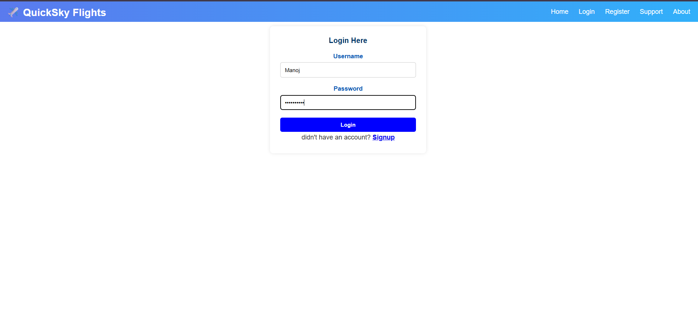
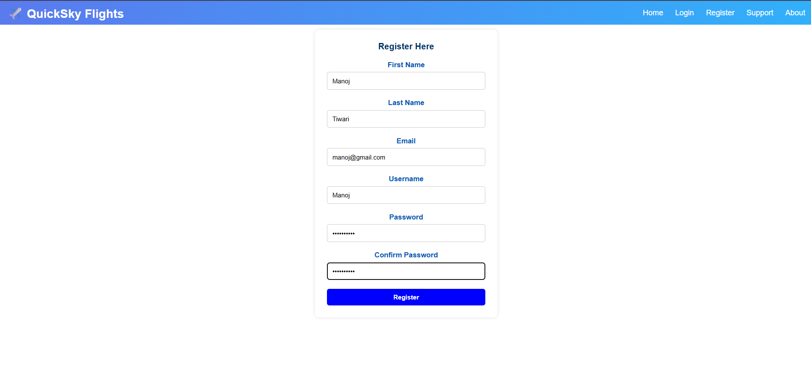
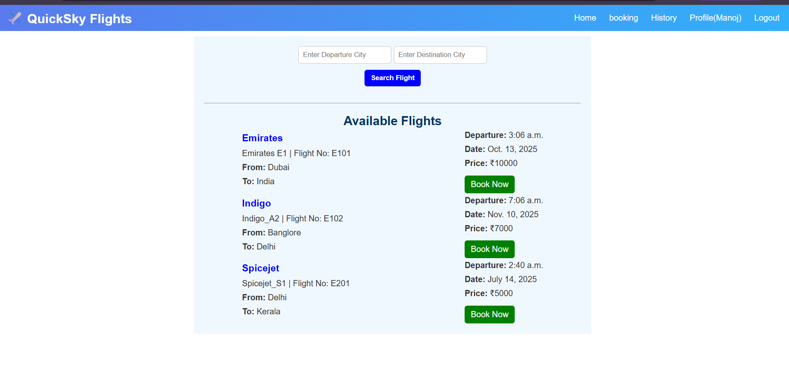
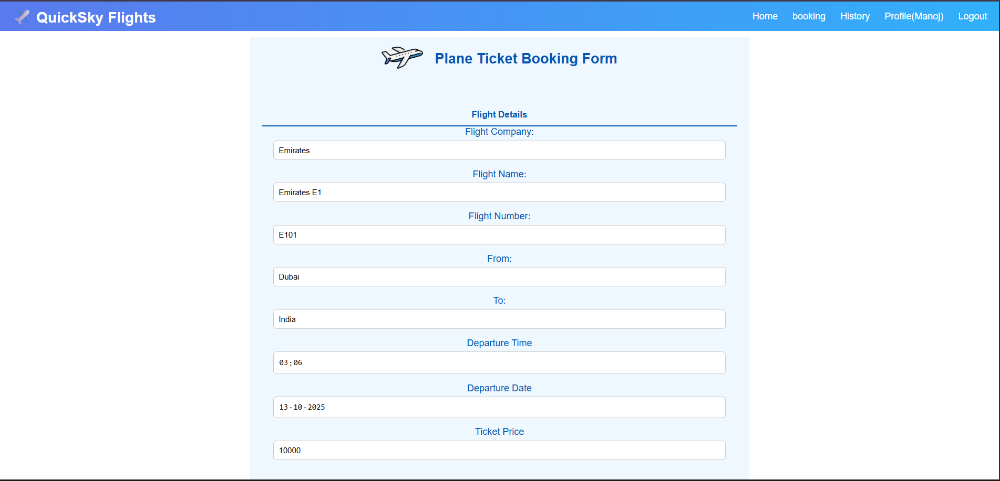
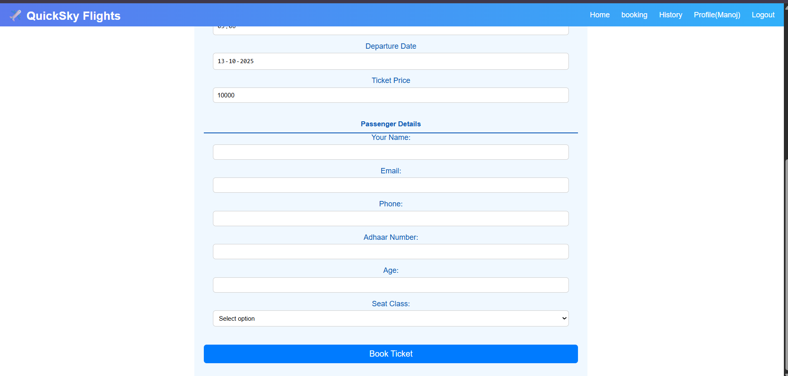
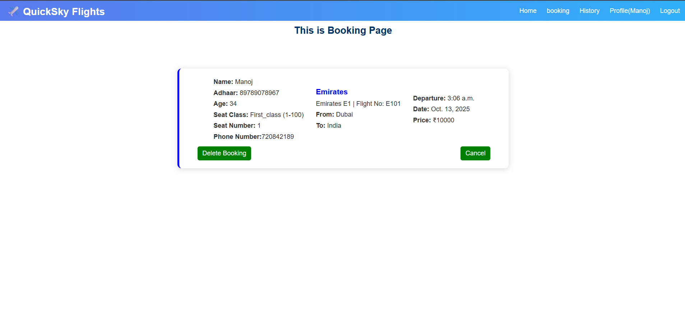
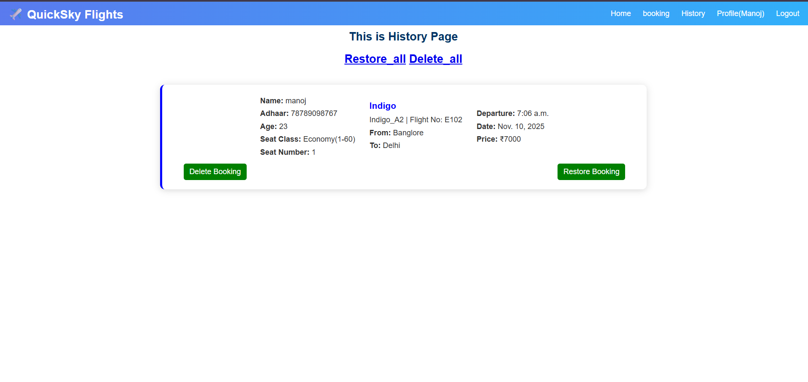
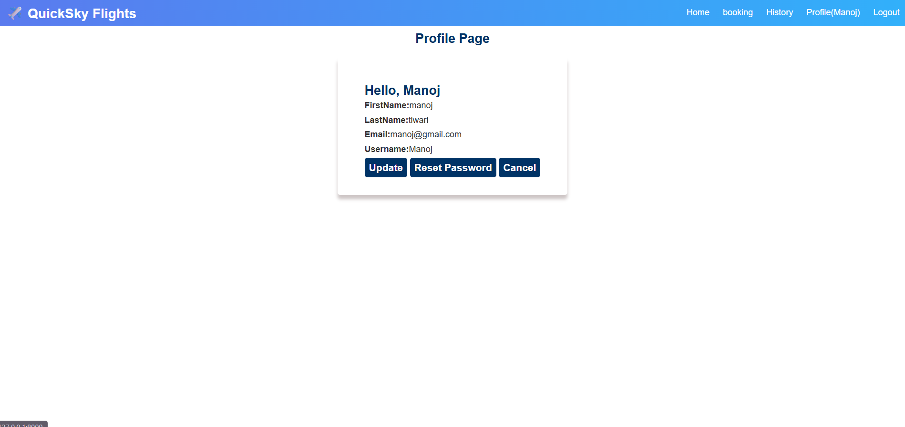
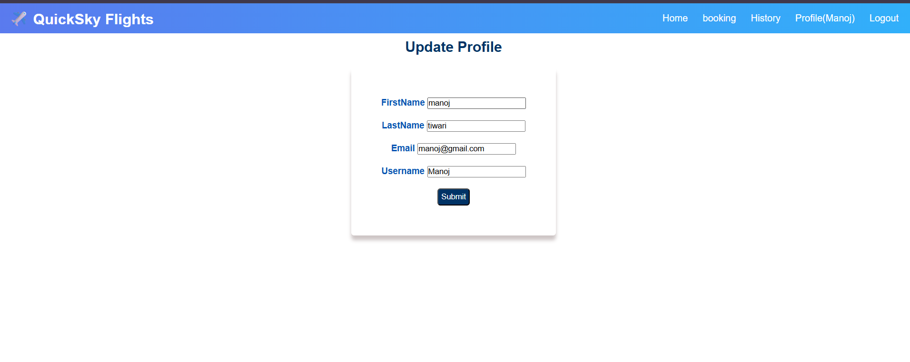
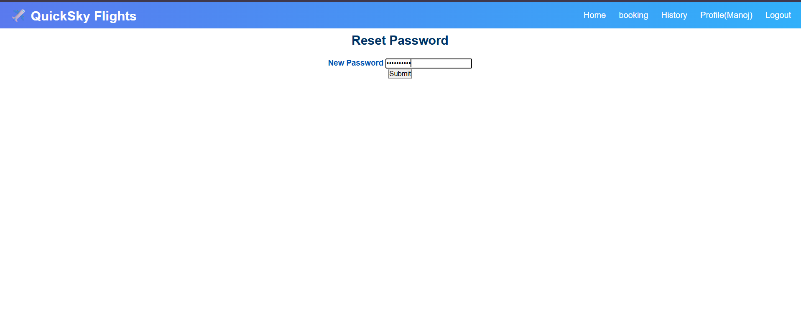

# ✈️ Flight Booking System (Django)

## Project Overview

The Flight Booking System is a Django-based web application that allows users to search flights, book tickets by seat class, and manage their bookings easily. Users can register and login, filter flights by departure and destination city, book seats with automatic seat number assignment, view booking history, restore deleted bookings, and manage their profile and password.

---

## Technology Used

- Python
- Django
- HTML
- CSS
- Django Templates
- SQLite Database
- Bootstrap

---

## Key Features

- User registration and login
- Flight search by city
- Seat class selection
- Automatic seat number assignment
- Booking management
- Booking history
- Soft delete & restore bookings
- Profile and password management

---

## ▶️ Run Project

- python manage.py runserver

Open browser:  
http://127.0.0.1:8000/

---

## 📷 Project Output Screenshots

### Login Page

### Register Page

### 🏠 Home Page

### 🔍 BookNoW Search

### 🎫 Booking Page

### 🕘 Booking History

### 👤 Profile Page

### 👤 Update Profile

### 🔐 Reset Password

---

## 👩‍💻 Author

Payal Gupta
